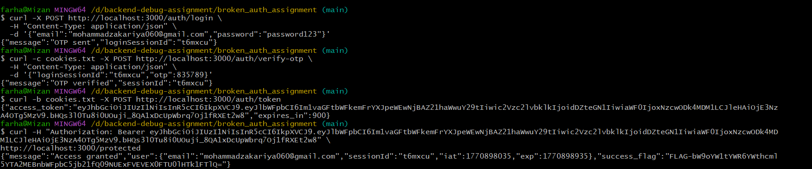

# The Silent Server – Backend Debugging Assignment (Fixed Version)

This repository contains the fixed and fully functional version of **The Silent Server** authentication API.

The original project was intentionally broken. All authentication bugs have been identified and resolved.

## Fix Summary

The following issues were debugged and resolved:

- Fixed request middleware flow (missing `next()` calls)
- Corrected OTP verification flow and session handling
- Fixed session cookie creation and reading
- Corrected JWT generation in `POST /auth/token`
- Fixed protected route middleware validation

The authentication flow now works end-to-end.

## Setup Instructions

### 1) Install dependencies

```bash
npm install
```

### 2) Start the server

```bash
npm start
```

Server runs at: `http://localhost:3000`

## Testing Notes

- The commands below are written for `curl` (Linux/macOS/Git Bash).
- If you use Windows PowerShell, `curl` can be an alias for `Invoke-WebRequest`. Use `curl.exe` or run the commands from Git Bash.
- Testing for this submission was performed using Git Bash on Windows.

## Complete Authentication Flow

### Task 1: Login

**Endpoint:** `POST /auth/login`

**Command (run in Git Bash):**

```bash
curl -X POST http://localhost:3000/auth/login \
  -H "Content-Type: application/json" \
  -d '{"email":"YOUR_EMAIL@example.com","password":"password123"}'
```

**Expected result:**

- Server logs OTP in console (example): `[OTP] Session abc123 generated: 456789`
- Response contains:

```json
{ "message": "OTP sent", "loginSessionId": "abc123" }
```

### Task 2: Verify OTP

Use the OTP from the server logs.

```bash
curl -c cookies.txt -X POST http://localhost:3000/auth/verify-otp \
  -H "Content-Type: application/json" \
  -d '{"loginSessionId":"abc123","otp":"456789"}'
```

**Expected result:**

- `cookies.txt` file is created
- Response:

```json
{ "message": "OTP verified" }
```

### Task 3: Generate JWT token

```bash
curl -b cookies.txt -X POST http://localhost:3000/auth/token
```

**Expected result:**

```json
{ "access_token": "eyJhbGciOiJIUzI1NiIsInR5cCI6IkpXVCJ9...", "expires_in": 900 }
```

### Task 4: Access protected route

Replace `<jwt>` with the token from Task 3.

```bash
curl -H "Authorization: Bearer <jwt>" \
  http://localhost:3000/protected
```

**Expected result:**

```json
{ "message": "Access granted", "user": "...", "success_flag": "unique_flag_value" }
```

## Output Artifact

The `output.txt` file in this repository contains:

- Terminal output of all 4 curl commands
- Final response including the `success_flag`

## Project Structure

```
broken_auth_assignment/
├── server.js
├── package.json
├── output.txt
└── screenshot/
    └── backend-curl.png
```

## Screenshot (Example Run)

This screenshot shows the successful execution of:

- Login
- OTP verification
- Token generation
- Protected route access



## Submission Details

- Code pushed to a public GitHub repository
- `output.txt` includes all required curl outputs
- Screenshot included inside `screenshot/`
- Final protected route response shows `success_flag` clearly

## Author

Mohammad Zakariya
